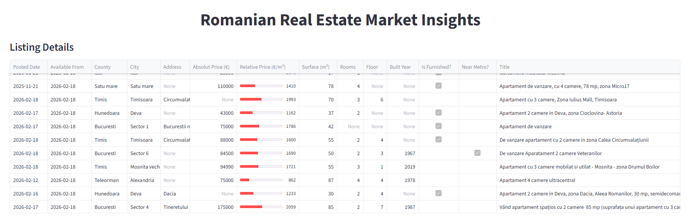
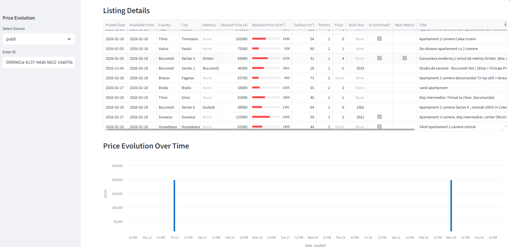

# Imobile

Romanian Real Estate Exploratory Data Analysis (EDA).


## Sources

### Publi
Data extracted from [www.publi24.ro](https://www.publi24.ro/)


## Structure
```
Imobile/
├──data/
│  ├───dim/
│  │   └───listings.parquet
│  └───mart/
│      └───listings_table.parquet
├──imobile_app/
│  └───app.py
├──imobile_loader/
│  ├───sql/
│  │   ├───01_schemas.sql
│  │   ├───02_staging.sql
│  │   ├───03_dim.sql
│  │   └───04_mart.sql
│  └───loader.py
├──imobile_scraper/
│  ├──imobile_scraper/
│  │  ├──spiders/
│  │  │  └───publi_spider.py
│  │  ├──sitems.py
│  │  ├──middlewares.py
│  │  ├──spipelines.py
│  │  └──settings.py
│  └───scrapy.cfg
├──imobile_transformer/
│  └───publi_transformer.py
├──media/
│  └───image_n.m.png
├──utils/
│  ├──logger.py
│  ├──args_parser.py
│  └──args_processor.py
├──.gitignore
├──LICENSE
├──README.md
├──requirements.txt
└──run_pipeline.sh
```


## Deliverables
- curated data
    - dim
        - listings.parquet
    - mart
        - listings_table.parquet
- framework

## Configure
Create virtual environment and activate it.
```
python -m venv venv
./venv/Scripts/activate
```

Install dependencies
```
pip install -r requirements.txt
```

## Run pipeline
Run full load for all available data sources.
```bash
./run_pipeline.sh --source all --mode full_load
```

Run starting from a date for specific data source
```bash
./run_pipeline.sh --source publi --mode from --from-date 2026-02-25
```

Run for specific date for few data sources
```bash
./run_pipeline.sh --source publi olx --mode date --specific-date 2026-02-25
```

**Note**: You can mix any kind of `source` with any kind of `mode`.


## Run service

### Run extractor
Extractor is developed using [Scrapy](https://www.scrapy.org/). To run just this service follow the run below. Use any available name of the spiders or sequence of names from the list of sources.
```bash
cd imobile_scraper
scrapy crawl publi
```


### Run transformer
Transformer is developed using [Pandas](https://pandas.pydata.org/). To run just this service follow the run below. Use any available name of the transformers.
```bash
cd imobile_transformer
python publi_transformer.py --source all --mode full_load
```


### Run loader
Loader is developed using [DuckDB](https://duckdb.org/). To run just this service follow the run below. Use any source and mode described above.
```bash
cd imobile_loader
python loader.py --source all --mode full_load
```

### Run app
Application is developed using [Streamlit](https://streamlit.io/). To run just this service follow the run below. Use any source and mode described above.
```bash
cd imobile_app
python streamlit run app.py
```


## Use

### Processed data
You can do ordering on data on each column, select specific column and download the resulted dataset.\


### Historical data
Select the source of data and enter a specific id of a record and analyse the price over time for it.\


